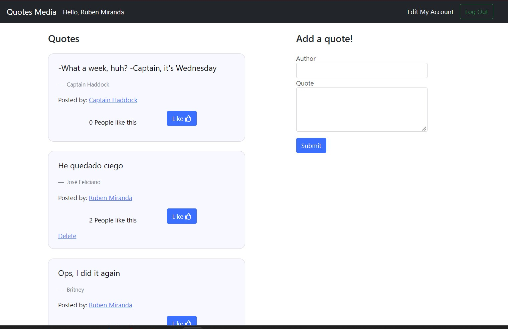
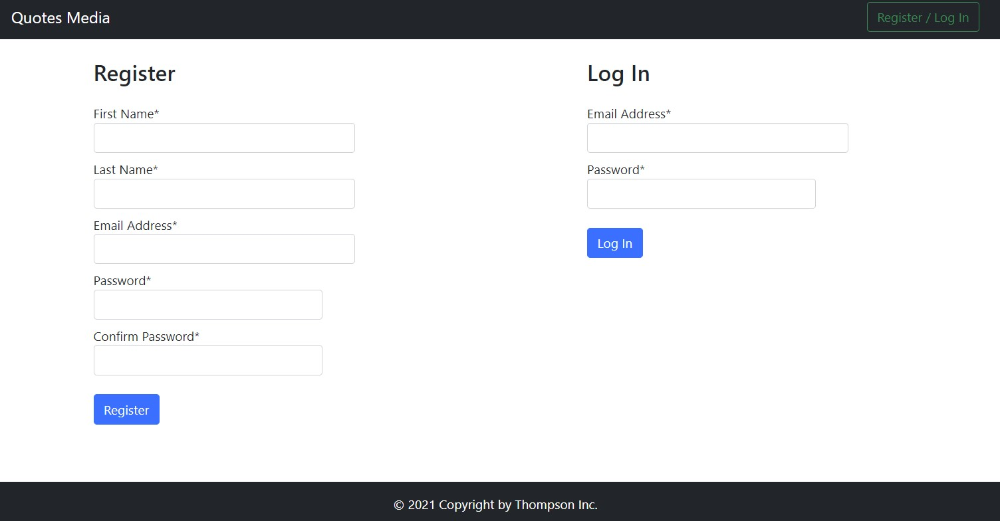
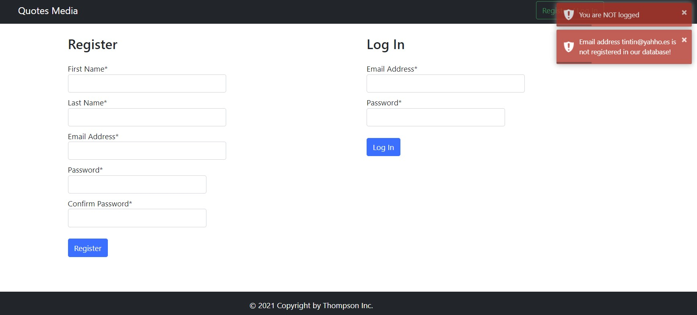
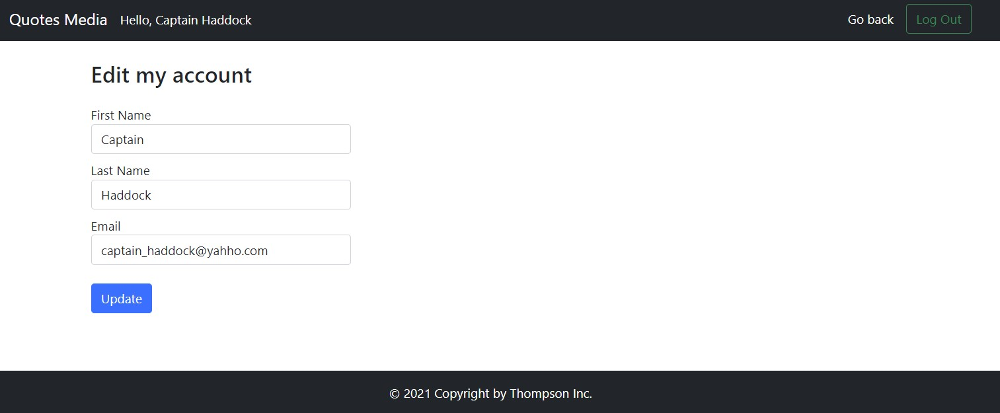

# django project: quotes media

I create a website when I can link with a SQLite database to register users, posts and likes. It is similar to the facebook wall.

You can insert a new quote, see the last quotes and give likes to an specific one. At the same time, appears the number of likes in every quote.

At first you can log in o register to this quote media

But if you write a wrong username and password, in a upper right appears interactive error messages. This was build using `toastr`.

When you access, you can edit your profile.

Quotes App was the exam of full-stack program provided by coding dojo. I've got a black belt :sunglasses:

##### *keep trying, knowledge is awesome*  :facepunch: